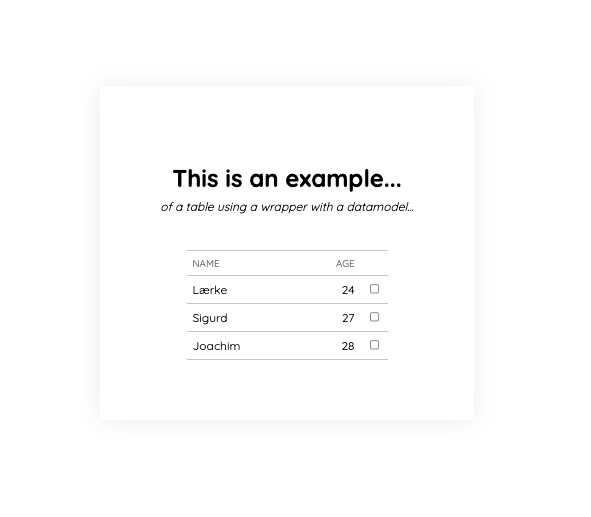

# Table wrapper example

A simple project that displays the concept of a wrapper component for a table, which is filled by some datamodel.

## Development server

Run `ng serve` for a dev server. Navigate to `http://localhost:4200/`.

---

